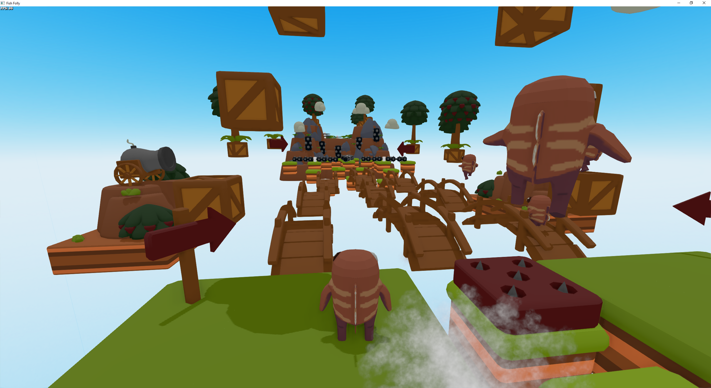

# Fish Folly

A FallGuys-like 3D platformer based on Fyrox Game Engine.

## How to build

Clone the repository at some folder, then you need **the latest** version of the engine 
[from GitHub](https://github.com/FyroxEngine/Fyrox), clone it near the game repository (or update to latest) and run 
one of the following commands. 

- `cargo run --package editor --release` - to run inside the editor (developer mode).
- `cargo run --package executor --release` - to run as standalone application.